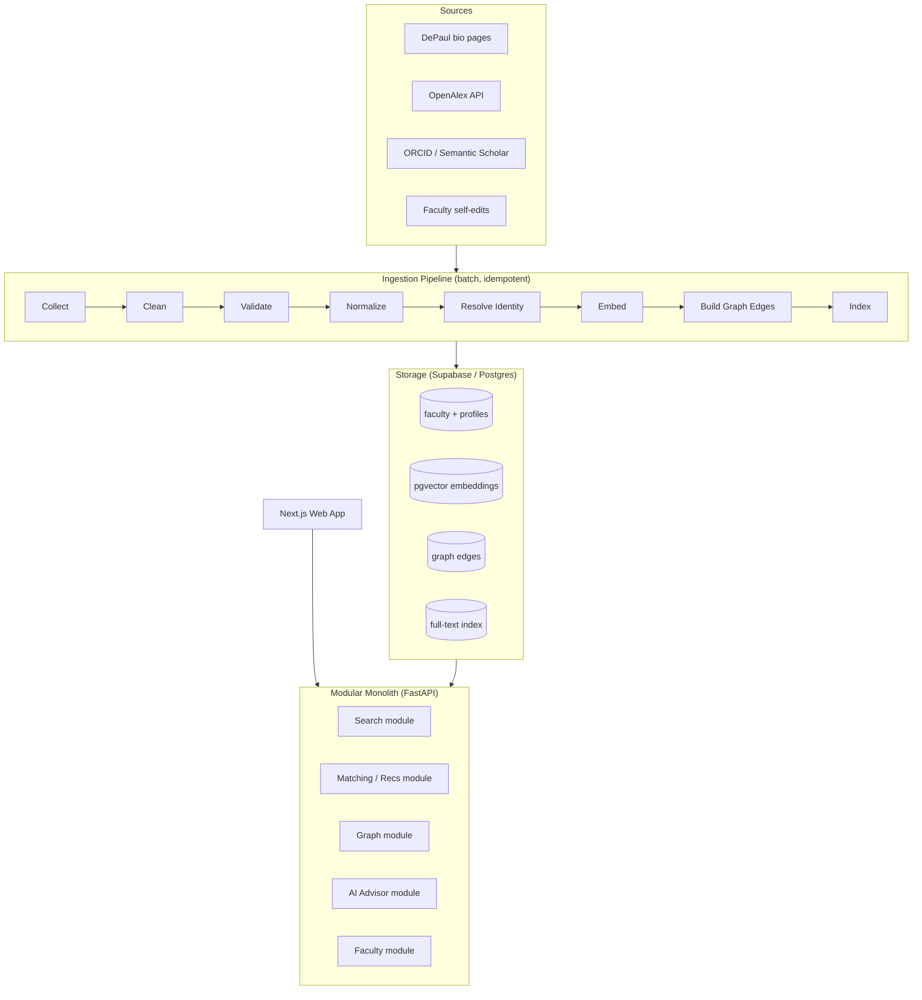
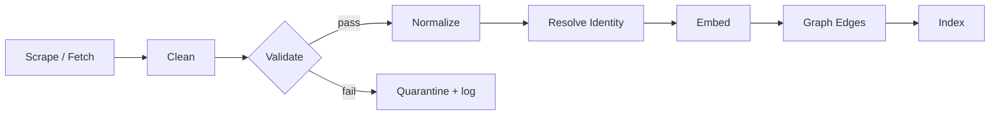
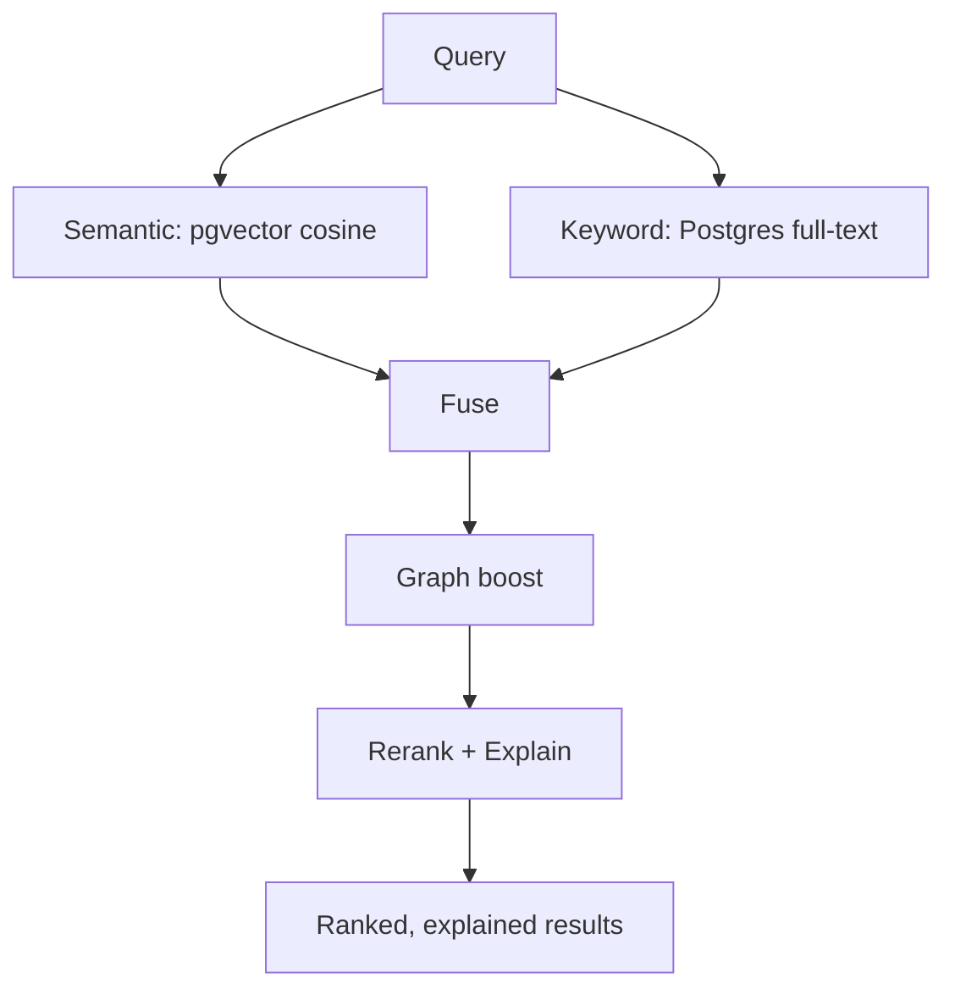

# DePaul Faculty Expertise & Matching Platform — Architecture & Design

**Status:** Working prototype → production design
**Audience:** Contributors, reviewers, and the project owner
**Scope:** Reviews the current system and specifies the target architecture, with trade-offs for every major decision.

---

## 1. Executive Summary

The platform answers one question well: *"Which faculty work on X, and who could they collaborate with?"* Today that works as a local prototype — a cleaned roster of **2,270 faculty**, **1,095** with research text scraped from their bio pages, embedded with a small sentence-transformer model and searched by cosine similarity.

The prototype proves the thesis. The job now is to turn it into something maintainable, explainable, and extensible without over-building.

The single most important architectural judgment in this document: **this is not a "scale" problem.** Two thousand faculty is a tiny dataset — it fits in memory and always will. The real risks are *data quality*, *identity resolution* (matching the same person across sources), and *explainability* (never returning a match you can't justify). The design below optimizes for those, and deliberately resists premature distributed-systems complexity.

The recommended shape is a **modular monolith**: one Python service (FastAPI) with clean internal module boundaries, backed by Postgres + pgvector (Supabase), with a Next.js front-end. No microservices, no message queues, no graph database — until a concrete need forces each one. Every such "not yet" is called out with the trigger that would change the decision.

The knowledge graph the project wants is real and appropriate, but it is a **Phase 3** capability layered on relational tables, not a day-one Neo4j cluster.

---

## 2. System Architecture (Target)



The two halves are independent on purpose. The **pipeline** runs as scheduled batch jobs and writes to the store. The **service** only reads the store (plus faculty writes). Decoupling them means a bad scrape can never take down search, and search can be developed against a frozen snapshot.

---

## 3. Architecture Review of the Current System

### Strengths

- **The pipeline is staged and reproducible.** Collect → enrich → embed → search are separate scripts with explicit inputs and outputs. This is the right backbone and most of the production design simply formalizes it.
- **Scraping is cached and polite.** `bio_cache/` makes re-runs idempotent and cheap; the rate-limit/back-off and resumability are correct instincts that protect both you and the source.
- **The data-quality feedback loop already happened once.** `inspect_bios.py` found that coverage jumped from 143 → 1,095 by handling heading variants. That diagnostic-then-fix discipline is exactly what a production data pipeline needs, and it should become a permanent, automated check (see §10).
- **Embeddings are cached and the engine is local and free.** No API keys, no per-query cost, runs anywhere.

### Weaknesses & Technical Debt

| Issue | Why it matters | Fix (phase) |
|---|---|---|
| **Cache invalidated by record *count* only** (`search_faculty.py`) | If content changes but the count stays the same, you silently serve stale embeddings. This is a correctness bug, not a style nit. | Hash the input text; rebuild on hash change (P1) |
| **`research_summary` mixes clean research with biography fallback** | ~The 1,095 is inflated by bio prose; matching quality varies and there's no flag saying which is which. | Add a `research_provenance` field: `research_section \| bio_fallback \| none` (P1) |
| **Identity is name-based** | Merging OpenAlex/ORCID by display name will mis-join ("J. Smith") and split ("José" vs "Jose"). | Stable keys: email as natural key, plus ORCID/OpenAlex IDs (P1–P2) |
| **No schema or validation** | Fields can silently drift; a malformed record fails at query time, not ingest time. | Pydantic models + validation gate (P1) |
| **Parsing rules hardcoded in the scraper** | Heading list, fetch, and IO are entangled in one file; hard to test. | Split into `collect` / `parse` / `io` modules (P2) |
| **No tests, logging, or metrics** | Regressions and data drift are invisible. | Golden eval set + structured logging (P1–P3) |
| **PII (emails) committed to the repo** | Governance/privacy risk, even in a private repo. | Move data to Postgres; keep repo code-only (P2) |

### Scaling Risks — Honest Assessment

At 2,270 records the dataset is **~2 MB of embeddings**. There is no data-volume scaling problem and there won't be one. Do not shard, queue, or microservice for load you will never see. The only "scale" that matters here is **scope** — more *features* (graph, advisor, partners), not more *rows*. Engineer for that with clean module boundaries, not horizontal scaling.

### Data-Quality Risks (the real risks)

- **Stale bios** — a scrape is a point-in-time snapshot; faculty change. Mitigation: scheduled re-scrape + faculty self-edit.
- **Fallback prose polluting matches** — teaching philosophy in a "Biography" section can outrank real research. Mitigation: provenance flag + down-weight fallback text in ranking.
- **Sparse structured data** — only 289 have parsed publications and `research_topics` is empty (Ollama never run). Mitigation: OpenAlex publications (P2) + local topic-tag extraction (P2).

---

## 4. Repository Structure

A modular monolith. One installable package, clear module boundaries, no service sprawl.

```
depaul-faculty-matcher/
├── src/faculty_matcher/
│   ├── models/          # Pydantic schemas — the contract every layer shares
│   ├── data/            # collectors (bio, openalex), parsers, io, cache
│   ├── pipeline/        # orchestration: clean→validate→normalize→embed→index
│   ├── identity/        # entity resolution (merge a person across sources)
│   ├── embeddings/      # encode + vector store adapter
│   ├── search/          # semantic + keyword + fusion + reranking
│   ├── matching/        # recommendations + explanation builder
│   ├── graph/           # nodes/edges builder + graph queries (GraphRAG)
│   ├── advisor/         # "how could I use AI in my research" RAG flow
│   ├── api/             # FastAPI routers, request/response models, versioning
│   └── observability/   # logging, metrics, health
├── data/                # .gitignored — local snapshots only, never committed
├── scripts/             # thin CLI entrypoints that call into src/
├── tests/               # unit / integration / data_validation / search_eval
├── docs/                # this file, data dictionary, diagrams, contributing
├── config/              # settings.py (pydantic-settings) + .env.example
└── pyproject.toml
```

**Why each folder exists** (the non-obvious ones): `models/` is first because the schema is the shared contract — every other module imports from it, nothing imports back. `identity/` is its own module because entity resolution is the hardest correctness problem and deserves to be isolated and tested in one place. `graph/` exists as a seam from day one even though it's empty until Phase 3 — reserving the boundary now means adding it later doesn't require a refactor. `scripts/` stays *thin* (argument parsing only) so logic lives in `src/` where it's testable; the current top-level scripts become these.

**Trade-off:** a monolith means everything deploys together — you can't scale one module independently. At this size that's a feature (simpler ops, one codebase, easy local dev), not a limitation. The trigger to reconsider would be a component with genuinely different scaling or latency needs, e.g. the AI advisor becoming a heavy GPU service.

---

## 5. Data Pipeline



Each stage has a single responsibility, reads from the previous stage's output, and is **idempotent** — re-running produces the same result and never double-writes. This is what makes the pipeline safe to re-run after any failure.

- **Interfaces:** every stage is `def run(input: list[Model]) -> StageResult`, where `StageResult` carries `ok`, `quarantined`, and `metrics`. Uniform signatures make the orchestrator trivial and stages independently testable.
- **Schemas:** Pydantic models (see §6) are the gate between stages. Validation runs *at ingest*, so bad data is caught at the boundary, not three stages later.
- **Error handling & retries:** network calls retry with exponential back-off (already present in the scraper); a record that fails validation is **quarantined** (written to a side table with the reason) rather than dropped silently — so you can see and fix it.
- **Caching:** raw fetches cache to disk by URL (already done). Embeddings cache by **content hash**, not count — the fix for the current staleness bug.
- **Idempotency:** identity resolution assigns a stable `faculty_id`; re-ingesting the same person updates in place (upsert by key) instead of creating duplicates.

**Trade-off:** batch (not streaming) means data is as fresh as the last run. For a faculty directory that changes weekly at most, a nightly/weekly job is correct and far simpler than streaming infrastructure. Trigger to revisit: real-time faculty self-edits needing instant search visibility — handled by writing self-edits straight to the store and re-embedding just that one record on save.

---

## 6. Data Models

Strongly typed Pydantic schemas. Examples below are abbreviated; validation rules in **bold**.

```python
class Faculty(BaseModel):
    faculty_id: str            # stable key (email-derived slug). REQUIRED, unique.
    name: str                  # non-empty
    email: EmailStr | None     # validated email; natural identity key
    college: str | None
    department: str | None
    title: str | None
    bio_url: HttpUrl | None
    research_summary: str = ""
    research_provenance: Literal["research_section","bio_fallback","none"] = "none"
    research_topics: list[str] = []        # tags (from LLM extraction)
    orcid: str | None = None               # cross-source identity
    openalex_id: str | None = None
    publication_ids: list[str] = []        # references, not embedded blobs
    course_ids: list[str] = []
    updated_at: datetime
    source_provenance: list[str] = []      # ["bio_page","openalex","self_edit"]
```

Other models follow the same discipline:

- **Department / College** — `id`, `name`, `parent` (dept→college). Validation: every faculty `department` must resolve to a known Department (or be quarantined).
- **Publication** — `id`, `title` (**non-empty**), `year` (**1900–next year**), `doi`, `authors` (faculty_id refs), `cited_by_count`. Source: OpenAlex.
- **ResearchTopic** — `id`, `label`, `aliases[]`. Normalized vocabulary so "ML" and "machine learning" collapse to one node.
- **Course** — `id`, `code`, `title`, `department`.
- **Grant** *(Phase 4)* — `id`, `title`, `pi` (faculty_id), `co_pis[]`, `agency`, `amount`, `dates`.
- **CommunityPartner** *(Phase 4)* — `id`, `org_name`, `focus_areas[]`, `contact`.

**Design choice — references over embedding blobs:** Faculty hold *IDs* of publications/courses, not nested copies. This keeps records small, avoids duplication, and lets a publication be shared by co-authors without conflicting copies. Trade-off: reads need a join, which at this size is free.

---

## 7. Search & Matching Architecture

Hybrid retrieval with transparent scoring.



**Why hybrid:** semantic search catches meaning ("fish evolution" → "evolutionary diversification in fishes") but can miss exact terms (a specific method, a gene name, a course code); keyword search nails exact terms but misses paraphrase. Fusing both covers each other's blind spots. This is the concrete reason the project's GraphRAG instinct is right — but note the *graph* is a **signal**, not the primary retriever.

**Ranking formula** (starting weights — tune against the eval set in §10):

```
score = 0.60 * semantic_similarity        # cosine, 0–1
      + 0.25 * keyword_score              # normalized BM25
      + 0.15 * graph_signal               # shared dept / co-author / topic proximity
      - penalty(provenance == bio_fallback)   # down-weight non-research prose
```

**Explainability (non-negotiable):** every result returns *why*. The reranker records which query terms matched which research phrases, which topics overlapped, and which publications contributed. No result is shown without this evidence object (see §8). This both builds trust and is your best debugging tool when a match looks wrong.

**Failure handling:** empty results → widen (drop keyword filter, lower threshold) and label the response `low_confidence` rather than returning nothing or, worse, a confident bad match. Model-load failure → health check fails loudly; search returns 503, never silent wrong answers.

---

## 8. GraphRAG Design

**Nodes:** Faculty, Department, College, ResearchTopic, Publication, Course, Grant, CommunityPartner.
**Edges:** `AFFILIATED_WITH` (faculty→dept→college), `AUTHORED` (faculty→publication), `CO_AUTHORED` (faculty↔faculty, derived), `WORKS_ON` (faculty→topic), `TEACHES` (faculty→course), `FUNDED_BY` (faculty→grant), `PARTNERS_WITH` (faculty→partner).

**Storage strategy — start relational.** Model edges as a plain Postgres table `(src_id, edge_type, dst_id, weight)` with indexes. At this node/edge count, recursive CTEs handle 1–2 hop queries ("co-authors of X", "people in adjacent departments working on topic T") in milliseconds. **Why not Neo4j now:** it's a second datastore to run, sync, back up, and learn, bought for query patterns a single SQL table already serves. **Trigger to adopt a real graph DB:** queries routinely need 3+ variable-length hops or path-finding ("shortest collaboration path between two faculty"), where recursive SQL gets ugly.

**Update strategy:** edges are derived in the pipeline's graph stage and fully rebuilt per run (cheap at this size) — simpler and less bug-prone than incremental edge maintenance.

**Query patterns the graph enables:** collaborator recommendations (co-author + shared-topic neighbors not yet co-authored with), interdisciplinary bridges (topic shared across different colleges), and grounding for the AI advisor ("faculty near your topic who've used method M").

**When to introduce it:** Phase 3. The semantic layer alone answers the most common question ("who works on X"); the graph adds the *relationship* answers on top. Building it first would produce a beautiful web of connections that still can't answer the primary query.

---

## 9. API Design

FastAPI, versioned under `/v1`, OpenAPI auto-generated.

| Endpoint | Purpose |
|---|---|
| `GET /v1/faculty` | List/filter (by college, dept, has_research); paginated |
| `GET /v1/faculty/{id}` | Full profile + provenance |
| `GET /v1/search?q=` | Hybrid search; returns ranked results **with explanations** |
| `GET /v1/recommendations/{id}` | Collaborators for a faculty member |
| `POST /v1/advisor` | "How could I use AI in my research?" — grounded RAG answer |
| `GET /v1/graph/faculty/{id}` | Neighborhood subgraph for visualization |

**Search response (shape):**

```json
{
  "query": "fish evolution",
  "confidence": "high",
  "results": [{
    "faculty_id": "windsor-aguirre",
    "name": "Windsor Aguirre",
    "department": "Biological Sciences",
    "score": 0.91,
    "why": {
      "matched_topics": ["evolutionary biology", "ichthyology"],
      "matched_phrases": ["evolutionary diversification in fishes"],
      "evidence_publications": ["W123..."],
      "signals": {"semantic": 0.88, "keyword": 0.40, "graph": 0.10}
    }
  }],
  "page": {"limit": 10, "offset": 0, "total": 7}
}
```

**Conventions:** cursor or offset pagination on all lists; consistent error envelope (`{error: {code, message, request_id}}`); filtering via query params; **versioning via URL prefix** so `/v2` can change shapes without breaking `/v1`. Trade-off: URL versioning is slightly less elegant than header negotiation but far more obvious to a new contributor — which matches the project's "intern-productive in an hour" goal.

---

## 10. Observability & Testing

**Observability:** structured JSON logs with a `request_id` per call; metrics for search latency, **zero-result rate**, **low-confidence rate**, and pipeline coverage; a `/health` endpoint that checks model + DB + index. The one bespoke dashboard worth building is **data quality**: % of faculty with real research sections vs. fallback vs. none, publication coverage, and staleness (days since last scrape). That dashboard is what turns the one-time `inspect_bios.py` insight into a standing signal.

**Testing strategy:**

- **Unit** — parsers (heading extraction on fixture HTML), scoring math, identity-resolution rules.
- **Integration** — each pipeline stage end-to-end on a small fixture set.
- **Data validation** — schema conformance + threshold guards (e.g. *fail the build if research coverage drops below 1,000*); this catches a regression like the original 143-vs-1,095 silently.
- **Search evaluation** — a **golden query set**: ~30 queries with expected faculty (e.g. `"fish evolution" → Aguirre in top 3`, `"AI in healthcare" → known faculty`). Run on every change; report precision@k. This is the single highest-leverage test — it makes "did I make search better or worse?" an objective question.
- **End-to-end** — query API → ranked, explained results.

---

## 11. Documentation Plan

- **README** — what it is, 5-minute quickstart (already started).
- **ARCHITECTURE.md** — this document.
- **DATA_DICTIONARY.md** — every field, type, source, and validation rule (generated from the Pydantic models so it never drifts).
- **CONTRIBUTING.md** — setup, run tests, add a data source, coding standards.
- **API docs** — auto-served by FastAPI at `/docs` (OpenAPI), zero maintenance.
- **Diagrams** — the Mermaid diagrams here render natively on GitHub; keep them in-repo so they version with the code.

The test of success: a new contributor clones, runs one setup command, runs the golden eval, and understands the data flow — within an hour.

---

## 12. Implementation Roadmap

**Phase 1 — Foundation (correctness, not features).** Pydantic models + validation gate; stable `faculty_id` and provenance flag; fix embedding cache to hash-based; build the golden eval set; wrap the existing search in a FastAPI `/v1/search` endpoint. *Outcome: same features, now trustworthy and testable.*

**Phase 2 — Depth.** Run the OpenAlex extractor (publications/topics); run local Ollama topic-tag extraction to fill `research_topics`; structure publications; move data from JSON files into Supabase Postgres + pgvector; add faculty login (Supabase Auth) so people can claim and correct profiles. *Outcome: richer, self-maintaining data in a real store.*

**Phase 3 — Hybrid search + graph + advisor.** Add keyword search and fusion; build the explanation/evidence layer; build graph edge tables (GraphRAG-lite) for collaborator recommendations; ship the AI advisor as grounded RAG; build the Next.js chat UI. *Outcome: the product as envisioned.*

**Phase 4 — Reach.** Grants and community-partner matching; analytics and data-quality dashboards; evaluate a dedicated graph DB only if multi-hop queries demand it. *Outcome: interdisciplinary and external matching.*

The throughline: **earn each layer of complexity.** Every phase ships something usable, and nothing is built before the thing beneath it is solid.
