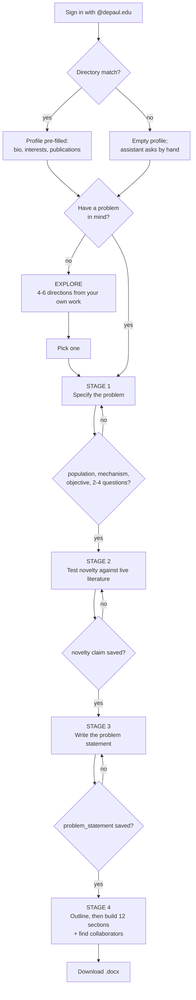

# Advisor & Explore

Three bots, one proposal. What each one asks, the checkpoints it cannot skip, the
rules it works under, and what happens when a conversation goes sideways.

Reflects the prompts and gating logic in `web_app.py` as deployed. Behaviour is
enforced partly in code (stage gates, hand-edit locks, tool schemas) and partly
in prompt instructions.

---

## The three surfaces

Separate bots, separate jobs. None of them can do another's work.

| Surface | Owns | Will not do |
|---|---|---|
| **Profile assistant** — `/profile` | Correcting what public sources got wrong: bio, research interests, which publications are actually yours. | Discuss research directions or touch a proposal. |
| **Explore** — `/explore` | Proposing new directions drawn from your own publications, for someone with no project yet. | Claim novelty, run stages, or write a proposal section. |
| **Advisor** — `/advisor` | Turning one research problem into a full proposal, then finding collaborators. | Suggest what you should study, in Stage 1. |

Explore and the Advisor do *opposite* things, which is why they are not one bot
with a switch. The Advisor refuses to propose directions in Stage 1 precisely so
it cannot lead you toward its own idea of your research. Explore does nothing but
propose. Housing both in one prompt required a paragraph suspending the other's
central rule.

---

## The whole flow

### The mechanic that makes this work

The current stage is **derived from what is saved in the database**, never from
what the bot remembers. A server restart, a closed tab, or a session resumed
three weeks later all land in exactly the right place, because the proposal
itself is the state.

| Saved state | Stage the bot is told it is in |
|---|---|
| `problem_statement` is non-empty | Stage 4 — build the proposal |
| `novelty` non-empty, `problem_statement` empty | Stage 3 — write the problem statement |
| both empty | Stages 1–2 — specify, then test novelty |

`problem_statement` is checked *first* on purpose. A project that acquired one
before novelty existed as a step is not dragged back to the beginning.

> **The stage numbering is ours, not Bamshad's.** His specification has three
> stages, each with a named deliverable. Ours has four, because novelty testing
> and problem-statement drafting need separate gates in the database. They line
> up like this:
>
> | Bamshad's stage | Its deliverable | Ours |
> |---|---|---|
> | Stage 1 | A 3–4 paragraph problem statement with framed context and research objectives | Stages 1–3 |
> | Stage 2 | A two-page outline covering seven elements | Stage 4, the outline that opens it |
> | Stage 3 | Expanded literature review, falsifiable hypotheses, specified methods | Stage 4, the sections |

### The lenses

The prompt carries Bamshad's nineteen-point framework for interrogating a
research idea: core phenomenon, research claim, why it matters, scope and
boundaries, mechanism, competing explanations, hidden assumptions, genuine
uncertainty, causal structure, operationalization, unit and level of analysis,
discriminating evidence, falsifiability, feasibility, contradictions and
anomalies, contribution, the skeptical reviewer, expert-only knowledge, and the
missing dimension the discipline demands.

Three things govern how they are used, and each has a test:

- **They are silent.** The advisor reads an answer through several of them,
  finds the one place the idea is soft, and asks about that. It never names a
  lens, never walks them in order, and never produces a numbered audit. The
  researcher should meet a colleague who asks unusually good questions, not a
  rubric applied to them.
- **They still produce one question.** The list is the strongest pull toward
  interrogation anywhere in the prompt, so it restates the one-question limit
  itself.
- **They do not licence supplying answers.** Competing explanations and
  discriminating evidence both tempt the model to hand over candidate content,
  which is exactly what the interview rule forbids and what breaks collaborator
  matching. In Stages 1–3 the lens finds *what* to ask about; the question is
  still "what else could produce that pattern?", never "could it be selection or
  drift?". Competing explanations get checked against the **literature** in
  Stage 2, where a real search is the evidence rather than the bot's guess.

Two lenses are stage-gated, and the stage rules win. Feasibility is a Stage 4
question because asking what data someone has while the problem is still vague
quietly reshapes the problem to fit the data. Contribution is found any time;
only Stage 2, after a search, decides whether it is *novel*.

**Lens 18 is the one that changes what a turn is worth.** The best question in
any turn is one only the professor can answer — from experience, intuition, an
unpublished observation, the result that never made it into a paper. Anything
retrievable from their profile, computable, or findable by search is the
advisor's job to look up, not theirs to answer. Their time is the scarce
resource in the conversation. The send check enforces this on every message.

---

## Stage 1 — Specify the research problem

Mostly asking. The faculty member already has an idea; the job is making it
concrete.

### What it works through, in order

1. **A clear problem description.** Who or what it concerns, where, and precisely
   what. "Students" is not an answer; "first-generation undergraduates in intro
   CS courses" is. When an answer stays broad, it names the vague word back —
   *"'impact' is doing a lot of work there — impact on what, measured how?"* —
   and asks them to narrow it.
2. **The primary objective.** One sentence. It helps them say which kind of aim
   it is: *descriptive* (produce a record nobody has), *evaluative* (judge
   whether something works), or *interventional* (change practice).
3. **2–4 research questions.** Each answerable with evidence. If they can't say
   what evidence would settle it, it isn't specific enough yet. These get saved
   so they appear in the panel immediately.

> **CHECKPOINT — cannot leave Stage 1 until all four hold**
>
> A specific population or setting · a specific mechanism or outcome · a stated
> primary objective · 2–4 evidence-answerable research questions saved. The bot
> is told to check itself against that list before moving on.

### The rule that defines this stage

**Ask, don't prescribe.** The default move is a clarifying question, not a menu.
Only if someone is genuinely stuck — after it has actually asked and they've said
"I'm not sure" — may it offer options, and only framed as *"here are directions
people take this; which is closest to what you already have in mind?"*, never as
a recommendation of what they ought to study.

### It adapts to what it's given

| What arrives | What it does |
|---|---|
| **Rich** — a paragraph, an abstract, preliminary results | Interprets first. Acknowledges the direction in a clause proving it read, says what it takes the core question and implied gap to be, then asks only about what is genuinely missing. Never makes an experienced researcher restate their own paragraph as a form. |
| **Thin** — a line, a topic, an observation | One focused question at a time, built on their exact words. Never scolds the thinness. |
| **Nothing** — "I don't know what I want to work on" | Switches to ideation, grounded in their profile. This is the one place in the Advisor where it proposes directions, and only after they've said they're stuck. |

> **EDGE CASE — the opening does not summarise their past work**
>
> It greets them, says what you'll do together, and asks one open question,
> noting the idea *need not relate to their previous work*. It reads the profile
> constantly — to interpret answers, search the right literatures, judge novelty,
> find collaborators — but leading with it frames the project as a continuation,
> and someone moving into a new field then has to argue their way out of the
> description they were just handed.

---

## Stage 2 — Test whether it is new

A perfectly specific problem can still be one the field settled twenty years ago.

It calls `search_literature` against OpenAlex *before* saying anything about what
exists — never from memory — and grounds its account in the actual works
returned. More than one search when the problem has distinct facets. In the same
message it admits coverage is not exhaustive and asks what they know of that the
search missed.

A **research landscape** panel appears beside the chat: the works found as ranked
bars, longest first, each bar's length being how close that paper sits to their
idea. It reads that as evidence — if the top bar is essentially their project the
ground is crowded; a sharp drop-off after a couple of loosely-related papers
means the gap is real.

### Then a plain verdict

- **Clearly new** — say what makes it new and move on quickly. No manufactured doubt.
- **Partly covered** — name exactly which part is settled and which is still open.
- **Already well covered** — say so directly and kindly. Letting someone build on
  a solved problem costs them months.

### If it isn't novel, eight ways to make it so

New population or setting · new data · **new method** (an AI or data-science
technique that makes a previously infeasible analysis possible — always
considered) · new mechanism · new timeframe · contradiction · integration ·
scale.

Each written in terms of *their* project, then offered as pickable buttons. When
they choose one, it searches again on the narrowed version before blessing it.

> **EDGE CASE — the escape hatch, after about two rounds**
>
> If the searches keep showing the ground is covered, it stops looping.
> Pretending a fresh angle is one more question away is discouraging and
> dishonest. It puts three ways forward on the table and lets them choose:
> **replicate or extend** (a real contribution, not a consolation prize),
> **broaden or pivot**, or **proceed as-is** with an honest claim about what
> little is new. Every path still lands on a saved novelty claim, so nobody is
> stuck at a locked door.

> **CHECKPOINT — unlocks Stage 3**
>
> It must be able to complete this sentence concretely: *"Nobody has yet ___, and
> this project will."* Drafted in chat, confirmed with the researcher, then saved
> as `novelty`.

---

## Stage 3 — Write the problem statement

**Three to four paragraphs**, not one. This is the deliverable Bamshad's first
stage exists to produce, and the anchor everything afterwards has to serve:

1. The background that motivates the problem, and its real-world impact.
2. The specific problem in context — field, population or setting, and the
   scope, stated so a reader knows what is in and what is deliberately out.
3. How the problem has been addressed before, and the precise gap this project
   takes on. The saved novelty claim, written out as prose.
4. The research objectives that follow, and the specific approach or aspects
   this project will explore.

Before showing it, the advisor checks it against the five questions the finished
statement is judged on: is the problem description unambiguous; is there enough
background to motivate it; is the context and scope clear; does it say how the
problem was addressed before and what gap remains; is a specific novel approach
named. A "no" means something was missed earlier, and it goes back and asks
rather than writing around the hole.

It drafts in the chat, then asks:

> *Does this capture it, or would you change the emphasis?*

It revises until they agree, and only then saves.

> **CHECKPOINT — unlocks Stage 4**
>
> `problem_statement` saved, only after the researcher confirms the wording. No
> other proposal section may be drafted or saved before this.

---

## Stage 4 — Build the proposal

### First, the outline

Before any section is developed, the advisor writes a **two-page outline of the
whole proposal** covering seven elements: the general problem and its
motivation, the specific problem in its particular context, what others have
done, the knowledge gap, the key objectives and any novel solution, the research
questions with the experiments or analyses that would answer them, and the
expected results.

It is a sketch, and it is **not saved** — a proposal built section by section
from the start can be internally inconsistent for a long time before anyone
notices, because each section was settled alone and never read against the
others. The outline is a whole-shape draft cheap enough to throw away.

### Then the sections

Twelve, in order, one question at a time — but they can jump ahead or revisit at
will, and the list is a map rather than a march. Hypotheses may be skipped
entirely; keywords take one exchange.

| # | Section | What it pushes for |
|---|---|---|
| 1 | **Background** | What is broken or unknown, who is affected, what changed recently. Two or three developed paragraphs, not a summary line. |
| 2 | **Objectives** | 2–4 aims, each a full sentence saying what will exist or be known at the end. |
| 3 | **Research questions** | Deepened from Stage 1, not restarted. Grouped by theme. 3–5 total. |
| 3b | **Hypotheses** | *Optional.* Falsifiable statements where the tradition calls for them, each with the result that would refute it. Skipped for descriptive, interpretive, or humanistic projects — a hypothesis invented to fill a heading is worse than an empty section. |
| 3c | **Assumptions & delimitations** | Two different things, kept apart. What must be true for the design to hold (and which assumption does the *most work*, and what happens if it is false), versus the boundaries drawn on purpose. |
| 4 | **Literature review** | **3–5 studies** bearing directly on the gap, favouring the last ~5 years, each with what it established and where it stops short. Depth over breadth — padding makes the gap harder to see. Ends with an explicit gap statement matching the saved novelty claim. |
| 5 | **Research design & methodology** | 2–3 concrete approaches put on the table first, then converged. Three parts: the general approach and why it suits the problem; **the method for each research question, mapped one to one**; and the data analysis approach. A question with no method is unanswerable as written; a method answering no question is scope nobody needs. |
| 6 | **Role of AI & data science** | Where AI genuinely enters: as *method* (a specific technique against their real data) or as *subject*. Honest in both directions — what it buys them, and what it cannot be trusted to do. |
| 7 | **Ethical considerations** | Consent, privacy, risk, bias, IRB, responsible AI use — tied to their actual data. Boilerplate is explicitly refused. |
| 8 | **Expected outcomes** | 3–5 concrete outputs, each with a clause on who benefits. |
| 9 | **Plan of work** | Phases following the methodology components, each with a rough duration and what physically *exists* at the end of it. What a reviewer checks feasibility against. |
| 10 | **Conclusions & future work** | What will have been established, stated against the research questions, and the questions this project opens but does not answer. |
| 11 | **Keywords** | 4–8 terms in the vocabulary the field searches by. One exchange. |
| 12 | **Abstract** | Written *last*, once everything above is settled. ~150–250 words. Leads the finished document. |

> **Section 6 licenses the honest negative.** "AI is peripheral here, and here is
> why" is a savable, often correct answer. Bolting a method onto research that
> does not need it produces a weaker proposal. There is a test asserting that
> answer survives.

### Now it argues back

The stance inverts at Stage 4. A question-only advisor produces a thin proposal,
so it offers framings, points out tensions between things they've said, and puts
concrete options on the table to react against — *but on how to study the
problem, never on what problem to study.*

### Formatting the saved text

Research questions, literature review, methodology, AI role, and ethical
considerations save as bulleted lists once there's more than one item, each
bullet a full substantive sentence. Abstract, background, and objectives save as
prose. A section is never saved as a single short line — if that's all there is,
it isn't settled yet.

---

## Explore

The other door, for someone who has no project yet.

Its first message names what it reads their work as being about, then offers
**4–6 concrete directions**. Each is a specific researchable question in one
sentence, plus a clause on how it follows from work they've already done, plus a
clause on what would be new. Named against their actual papers, methods, and
populations — *"extend the caseworker-discretion work to the appeals process,
where nobody has looked"* is a direction; *"explore AI ethics"* is not.

It varies the distance deliberately: some a short step from current work, some a
real reach, at least one crossing into a field they have not published in. A list
of five safe adjacent ideas wastes their time.

> **What Explore refuses to do**
>
> It has **no literature search**. It is forbidden from claiming a direction is
> novel, unstudied, or that "nobody has done this" — it cannot know, and the
> Advisor verifies properly later against real literature. It says "this looks
> underexplored to me, and the advisor will check it" instead.

### The handoff

When they settle on one, it calls `start_project` with a short title and two or
three sentences describing the direction in *their* terms, says the advisor takes
it from here, and stops. It does not start specifying the problem, ask about
methods, or begin a proposal.

The direction is written into the project's intake background — what the Advisor
reads as their opening statement — but **nothing is written to the proposal
itself**. It is a starting point, not a settled section, so Stage 1 still has to
specify it by asking.

> **EDGE CASES**
>
> - **They dislike everything:** ask which came closest and what's wrong with it,
>   then offer a narrower set. After *two rounds* it stops generating and asks
>   what they'd rather work on.
> - **They already know what they want:** no menu is forced. It says this is
>   ready for the advisor, calls `start_project`, and lets them go.
> - **Thin profile:** it says so plainly and asks what they've been curious
>   about, rather than inventing directions from nothing.
> - **No profile at all:** the page doesn't open — exploring from nothing is a
>   model inventing a career.

---

## Rules that apply everywhere

| Rule | Why |
|---|---|
| **One or two questions per turn, never more.** One is the default. | A checklist of questions in one message is a grant form. It lands badly on someone who has only an observation. |
| **Save each section the moment it is settled.** | The researcher watches the proposal build itself in a panel beside the chat. Waiting until the end means watching nothing happen. |
| **Hand-edited sections are locked.** | If someone rewrites a section themselves, the advisor's text for it is discarded rather than overwriting their words. They can hand it back. |
| **Options render as buttons** — `[1]`, `[2]`… with the last always an escape hatch in their own words. | Only where choosing genuinely helps. Most turns have none. Nothing goes after the options. |
| **Never narrate app internals.** | No "the proposal panel is empty". The first real user opened their first conversation with a status report instead of an advisor. |
| **No em dashes, no stock AI phrasing.** | Researchers notice immediately. The target register is a busy professor emailing a colleague. |

---

## Edge cases worth knowing

| Situation | Behaviour |
|---|---|
| Email not in the directory | Still makes a profile, empty, and the assistant takes their background by hand. The name is left *blank* deliberately — deriving one from the address produced "Azhengis" for `azhengis@depaul.edu`, which is worse than nothing. |
| "This isn't me / I don't know these papers" | Believes them immediately and stops presenting the data as theirs. It cannot re-link to a different directory record and does not imply it can. It offers to clear the wrong material and rebuild from what they say. |
| Answers stay vague across a couple of exchanges | Stops pressing the same way, and does *not* switch to telling them what to think. |
| Resuming — chat looks empty but the proposal is full | Recognises a resumed session, doesn't reintroduce itself, picks up at the first real gap and says so. |
| Literature search fails | Says plainly the search failed this time and falls back to what it knows, flagged as unverified. It never pretends the search succeeded. |
| They ask for something else entirely | The offer is real. "Just find me people who do causal inference" gets a collaborator search, then back to the research when they want. |

---

## Tools and stored state

| Tool | Used by | Does |
|---|---|---|
| `search_literature` | Advisor | Live OpenAlex search. Feeds the novelty verdict, the landscape panel, and the accumulating reference list. |
| `search_faculty` | Advisor | Finds DePaul collaborators. The query must describe *technical skills needed*, not the subject domain. |
| `save_proposal` | Advisor | Writes one or more settled sections. Skips anything hand-edited. |
| `start_project` | Explore | Creates the project and hands over. Called only once a direction is actually chosen. |
| `update_profile` | Profile assistant | Bio, interests, activities summary, removing misattributed papers. |

Durable state lives in SQLite: `proposals` (11 section columns plus
`edited_sections`), `projects` (chat history, gap map, accumulated references,
mode), and `profiles`. Because the stage is read from those columns rather than
from memory, the conversation is resumable by construction.

> **OPERATIONAL NOTE — OpenAlex is now metered**
>
> Live literature search runs on OpenAlex, whose free tier is now a daily budget
> rather than unlimited. Unauthenticated requests get **$0.10/day** (~100 calls);
> a registered free key raises that to **$1/day**. Stage 2 makes several searches
> per novelty check, so this is the ceiling on how many faculty can use the
> advisor in a day.
